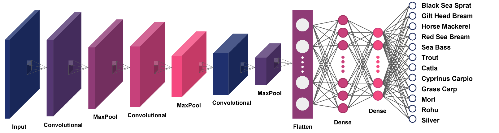
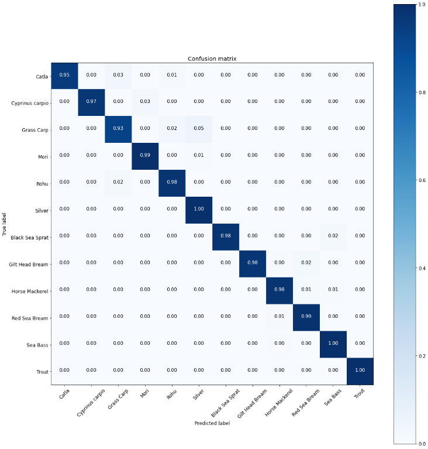

# Multi-class Fish Classification


## Datasets

#### Local Fish: 269 images

Catla = 18, Cyprinus carpio = 50, Grass carp = 11, Mori = 70, Rohu = 73, Silver = 47
```
Shah, Syed Zakir Hussain ; Rauf, Hafiz Tayyab; lali, IkramUllah; Bukhari, Syed Ahmad Chan;  Khalid, Malik Shahzaib; Farooq, Muhammad ; Fatima, Mahroze (2019), “Fish-Pak: Fish Species Dataset from Pakistan for Visual Features Based Classification”, Mendeley Data, V3, doi: 10.17632/n3ydw29sbz.3.
```

#### Coastal Fish: 280 images

Black Sea Sprat = 50, Gilt Head Bream = 50, Horse Mackerel = 50, Red Sea Bream = 50, Sea Bass = 50, Trout = 50
```
O.Ulucan, D.Karakaya, and M.Turkan.(2020) A large-scale dataset for fish segmentation and classification.
In Conf. Innovations Intell. Syst. Appli. (ASYU)
```

#### Image Augmentation: 
*Angle [range(15,180,15)], Horizontal, and Vertical*

Augmented 1 image to 24 images 

**Total dataset = 13176 images**


## Model

The model was build with Convolutional Neural Network (CNN) with the layers in figure.

**CNN Architecture**


Using the model, it has achieved **98.33 % accuracy**, which is highly satisfactory.

| Algorithm | Dataset Volume | No. of Classes | Accuracy |
|-----------|----------------|-------------------|----------|
| CNN       | 13176          | 12                | 98.33%   |


**Confusion Matrix**



N. B. Dataset not included in this repository.

## License
Copyright © 2022 (Dynamic DUO) Sajal Das & Shumaiya Akter Shammi.